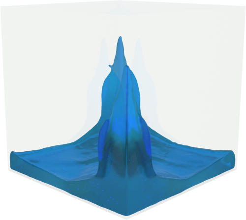

# libfluid
An implementation of weakly compressible SPH in CUDA. Solves 1m particles at 77 FPS on a 2080 RTX.

Screenshot rendered in Houdini.

Requirements:
- CUDA Samples. Get them using the following:
  git clone https://github.com/NVIDIA/cuda-samples.git
  Set the environment variable CUDA_SAMPLES_PATH to the root directory of cuda-samples
- TCLAP: this is installed when github is checked out with the "--recurse-submodules" parameter - if not you may have to modify the CMakeLists.txt to find the headers.

## Build instructions
1. Enter parent directory of the project.
2. Create a build directory and go into it: "mkdir build && cd build"
3. Call CMAKE to create the make files: "cmake -DCMAKE_INSTALL_PREFIX=.. .."
4. Assuming this worked build the project: "make" (note avoid -j as this may get stuck in CUDA projects)

## Execution instructions
Command line arguments for the test application are managed by TCLAP, so type "fluidtest --help" to find these out.
As a minimum you need a file path and filename base (supplied with the -f parameter.
This will save a sequence of .geo files which can be imported into Houdini.

